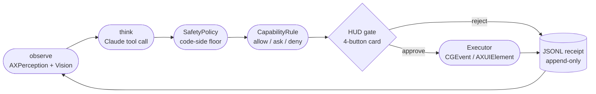

# macOS Agent v0
### A local-only, safety-first desktop agent for hands-free Mac operation

> Type a task; the agent drives any macOS app for you. It sees the screen
> through Accessibility + Vision, asks Claude what to do next, and gates every
> non-trivial action behind an on-screen card you approve with a click or a
> function key. Every action (approved, rejected, or failed) is written to a
> local audit receipt. No backend. No accounts. Your API key, your machine.

[](#license)
[](#requirements)
[](https://swift.org)
[](#honest-status)

## Who this is for

Operators who need the computer to do the clicking but won't babysit it
blindly: hands-free and accessibility-driven workflows, neurodivergent
operators who want predictable, non-time-pressured UI, and anyone who wants
an agent that asks before it does something irreversible. The design goal was
never maximum capability. It was an agent you can actually trust to touch your
machine.

## Honest status

This is a **v0**, stated plainly:

- **Proven (live-verified):** the safety machinery. Gates block at PREVIEW and
  CONFIRM, Reject prevents execution, Abort cancels, an unanswered gate parks
  and heartbeats forever rather than auto-resolving, and every action leaves a
  receipt. 643 automated tests cover the decision logic and safety policy.
- **Unproven:** real-world task-execution reliability. The automated tests
  mock perception, the LLM, and the executor, so they prove *logic and
  safety*, not that the agent drives a real app correctly. On real apps it
  over-navigates. That is a capability gap, not a safety gap: every fumble is
  still gated.
- **How it is being closed:** a measured verification program
  ([roadmap](docs/confidence-capability-roadmap-2026-06-16.md)) whose first
  move is a closed-loop success signal, so reliability becomes a number rather
  than a vibe.

An agent that operates your computer should earn trust by being *measurable*,
not by being impressive. That posture is the point of this project.

## What it is

A **single-user macOS desktop agent**. It observes whatever app is frontmost
through the Accessibility tree (and Vision OCR when AX is sparse), proposes
one action at a time via Claude, gates non-trivial actions through a HUD
approval card, and executes via `CGEvent` / `AXUIElement`. Every action
(approved, rejected, or errored) produces a JSONL receipt on local disk.

Think of it as a **junior copilot learning to drive any macOS app: it asks
before doing risky things and writes a signed receipt for every action.**

For why I built it this way and an honest account of what it can and cannot do,
see the [case study](docs/case-study.md).

## What this is NOT

- Not a production tool. Beta-quality. Behavior will change between releases.
- Not free to run — you supply your own Anthropic API key; Claude calls are
  billed to your Anthropic account per use.
- Not cloud-hosted. Runs entirely on your Mac.
- Not a browser agent. Sees Safari/Chrome/etc. through their AX trees, not
  through DOM access.
- Not multi-app orchestrated. One frontmost app at a time.

## Privacy disclosure

When the agent runs, the following **leaves your Mac**:

- Snapshot of the focused app's Accessibility tree (element labels, roles,
  frames) — sent to Anthropic's Claude API as part of each "think" step
- Vision OCR text of the focused window when the AX tree is sparse
- The task string you typed
- Recent conversation history (capped at 12 messages — about the last 6 action-pairs)

The following **stays on your Mac**:

- Anthropic API key (stored in the macOS Keychain)
- JSONL audit receipts (`~/Library/Application Support/MacAgent/receipts/`)
- Persistent capability rules (`~/Library/Application Support/MacAgent/capability-rules.json`)
- Agent memory / throughline (`~/Library/Application Support/MacAgent/throughline.json`; pre-2026-05-23 builds wrote to `~/MacAgent/throughline.json` and are migrated on first launch)

**Receipts include the exact text typed by the agent — including any
passwords or 2FA codes you approved during a run.** This is intentional
(audit-trail integrity), but it means the receipts folder is sensitive.
The Settings → Receipts section surfaces this disclosure in-app.

No third-party telemetry. No analytics. No crash reporting wired by default.

## Install — build from source

This is a v0; there is no signed binary release yet, so build it yourself:

```bash
git clone https://github.com/Stray-South/macos-agent
cd macos-agent
swift test                 # full suite should pass (643 tests)
swift build                # build the engine
./scripts/build-app.sh     # produces dist/MacOSAgentV0.app (ad-hoc signed)
open dist/MacOSAgentV0.app
```

On first launch:

1. Grant Accessibility in System Settings → Privacy & Security → Accessibility
   (required for any execution).
2. Optionally grant Screen Recording too, which enables the Vision OCR fallback
   for apps with sparse Accessibility trees.
3. Open Settings (⌘,) and paste your Anthropic API key; it is stored in the
   macOS Keychain.

Source builds are **ad-hoc signed** — macOS treats each rebuild as a
different app for TCC purposes, so you'll re-grant Accessibility on the
first launch of each new build. For testing across multiple sessions, the
released DMG (Developer ID signed + notarized) is more convenient.

## How it works



Each step writes a receipt — approved AND rejected. The loop terminates when
the model emits `.complete`, when a `deny` rule blocks, when a stall guard
fires, or when the user aborts.

See [`MANIFEST.md`](MANIFEST.md) for the full product spec and
[`PHASES.md`](PHASES.md) for the build history.

## Safety model

Three layers, each is a hard floor for the one above:

| Layer | What it does |
|---|---|
| **`SafetyPolicy.classify()`** | Code-side classifier — assigns AUTO / PREVIEW / CONFIRM tier based on action type, target label, app context, and dangerous-text patterns. Cannot be overridden by LLM, throughline, or capability rules. |
| **`AutonomyMode`** | User-controlled tier adjustment (Manual / Semi / Auto / Watch). Can tighten the floor; cannot loosen it for destructive/sensitive actions. |
| **Capability rules** | Per-app, per-action allow/ask/deny rules created from the 4-button HUD. `deny` blocks; `allow` widens to AUTO **only** if the action isn't destructive/sensitive. |

Plus loop-level guards: a 50-step budget and 8 stall detectors (wait, scroll,
same-target click, clarify-DoS, risky-keyCombo, no-progress, switch-app loop,
supersede churn), each with an honest terminal failure. An unanswered approval
card parks and heartbeats (every 60s) instead of auto-resolving — it never
auto-approves, and self-rejects only at the wall-clock park ceiling (default
60 min).

See [`RED-TEAM.md`](RED-TEAM.md) for the full adversarial test catalog —
65 specs covering AX injection, Vision OCR injection, throughline poisoning,
identity spoofing, excessive agency, DoS / loop abuse, and supply-chain
integrity.

## Architecture

- `Sources/MacAgentCore/Schema` — `AgentAction`, `SafetyPolicy`, `ActionLogEntry`, `PerceptionSnapshot`, `CapabilityRule`
- `Sources/MacAgentCore/Perception` — `AXPerception`, `VisionPerception`
- `Sources/MacAgentCore/Executor` — approved-action execution only
- `Sources/MacAgentCore/Orchestrator` — `observe → think → gate → act → receipt` loop
- `Sources/MacAgentCore/Overlay` — floating HUD approval card + highlight layer
- `Sources/MacAgentCore/Support` — `ReceiptWriter`, `KeychainStore`, `CapabilityRuleStore`, `AgentThroughline`
- `Sources/MacOSAgentV0` — SwiftUI app shell (launcher, settings, menu bar, welcome)

## Requirements

- **macOS 14** (Sonoma) or later
- **Anthropic API key** with Claude access ([console.anthropic.com](https://console.anthropic.com))
- **Accessibility permission** — required for any execution
- **Screen Recording permission** — optional; enables Vision OCR fallback

## Known caveats

- **Beta release.** Behavior may change between versions. Pin to a release
  tag if you need stability.
- **Ad-hoc signed dev builds** invalidate previously-granted TCC permissions
  on each rebuild (macOS scopes TCC to the binary's signing identity).
  Released DMGs are Developer ID signed + notarized — those persist grants.
- **macOS Sequoia / Tahoe** re-prompts for Screen Recording roughly monthly.
  This is OS-level behavior, not an app bug. The app surfaces a soft
  "Permissions reset" card when it detects this.
- **No file-system access.** The agent cannot read or write files except
  its own receipts and throughline.
- **No browser DOM access.** Safari and Chromium-based apps are treated as
  native AX trees like any other app — depth and accuracy varies by site.

## Costs

Each "think" step is one Claude API call. A typical 5-step task costs
roughly **$0.01–0.05** on Claude Sonnet 4.x at current API pricing.
You see the charges on your Anthropic account, not anywhere here. The
agent issues no calls when idle and stops at 50 steps per task by default.

## Commands

```bash
./scripts/check.sh                 # ◄ recommended — full local pipeline (build + test + bundle + smoke)
swift build                        # individual: build the engine
swift test                         # individual: run the test suite (643 tests)
swift run MacOSAgentSmoke          # individual: validate live Claude API path (one call)
./scripts/build-app.sh             # build the .app bundle (ad-hoc signed)
./scripts/run-app.sh               # launch the .app bundle
./scripts/notarize.sh              # Developer ID signing + notarization (requires Apple secrets)
./scripts/package-dmg.sh           # package the notarized .app into a distributable DMG
```

`check.sh` is the single command you run before every commit. It runs the
build (fails on any warning), the full test suite, the `.app` bundle assembly,
and the live API smoke test if an Anthropic key is available in your env or
keychain. Output is mirrored to `.local-ci.log` (gitignored) — on any
failure, the trap surfaces the log path so you can scroll back without
re-running.

## License

Licensed under either of:

- Apache License, Version 2.0 ([LICENSE-APACHE](LICENSE-APACHE) or
  http://www.apache.org/licenses/LICENSE-2.0)
- MIT license ([LICENSE-MIT](LICENSE-MIT) or
  http://opensource.org/licenses/MIT)

at your option.

Copyright © 2026 Southern Reach LLC.

## Contribution

This is a solo-maintained beta project. External contributions are not
being accepted at this time — see [CONTRIBUTING.md](CONTRIBUTING.md).

For security issues, see [SECURITY.md](SECURITY.md). Do not open public
issues for vulnerabilities.

Unless you explicitly state otherwise, any contribution intentionally
submitted for inclusion in this project by you, as defined in the
Apache-2.0 license, shall be dual-licensed as MIT OR Apache-2.0, without
any additional terms or conditions.

## Disclaimer

This project uses Anthropic's Claude API. "Claude" and "Anthropic" are
trademarks of Anthropic. This project is not affiliated with, endorsed by,
or sponsored by Anthropic.

The agent operates your computer at your direction. You are responsible
for any actions it takes — including any costs incurred by API usage or
any state changes to your Mac.
